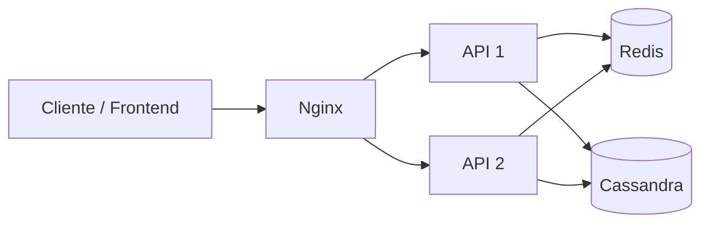

# URL Shortener

Projeto de estudos que implementa um encurtador de URLs simples, explorando conceitos e boas práticas de system design, como geração distribuída de códigos, cache, persistência, paginação, balanceamento de carga e escalabilidade horizontal.

## Funcionalidades

- Encurtar uma URL e copiar o endereço gerado.
- Redirecionar um shortcode para a URL original.
- Listar as URLs cadastradas com paginação.
- Cachear URLs acessadas para acelerar redirecionamentos.
- Executar múltiplas instâncias da API atrás de um balanceador de carga.
- Verificar a disponibilidade da API por um endpoint de health check.

## Arquitetura



- **Frontend:** interface em React para criar, listar e copiar URLs encurtadas.
- **API:** serviço Fastify responsável por validar requisições, gerar shortcodes e realizar redirecionamentos.
- **Redis:** mantém um contador compartilhado para gerar IDs únicos e funciona como cache dos redirecionamentos por 24 horas.
- **Cassandra:** armazena o shortcode, a URL original e a data de criação.
- **Nginx:** distribui as requisições entre duas instâncias da API.

Os shortcodes possuem 7 caracteres e são gerados convertendo o contador do Redis para Base62. Antes de salvar, a API verifica possíveis colisões no Cassandra e tenta gerar uma variação do código quando necessário.

## Tecnologias

- React, Vite, Tailwind CSS e TanStack Query
- Node.js, TypeScript, Fastify e Zod
- Redis e Cassandra
- Nginx e Docker Compose
- pnpm workspaces

## Endpoints

| Método | Rota | Função |
| --- | --- | --- |
| `POST` | `/shorten` | Cria uma URL encurtada. |
| `GET` | `/:shortcode` | Redireciona para a URL original. |
| `GET` | `/urls` | Lista URLs com `pageSize` e `pagingState` opcionais. |
| `GET` | `/health` | Verifica se a API está disponível. |

Exemplo para criar uma URL:

```bash
curl -X POST http://localhost:3333/shorten \
  -H "Content-Type: application/json" \
  -d '{"url":"https://example.com"}'
```

## Como executar

### Pré-requisitos

- Node.js 20+
- pnpm
- Docker e Docker Compose

Instale as dependências:

```bash
pnpm install
```

Inicie Redis, Cassandra, Nginx e as instâncias da API:

```bash
pnpm docker:up
```

Em seguida, inicie o frontend e uma instância local da API:

```bash
pnpm dev
```

- Frontend: `http://localhost:5173`
- API local: `http://localhost:3333`
- API balanceada pelo Nginx: `http://localhost`

Para encerrar os containers:

```bash
pnpm docker:down
```

## Estrutura

```text
apps/
  api/       API, regras de negócio e acesso a dados
  app/       Interface web
infra/       Docker Compose e configuração do Nginx
```
